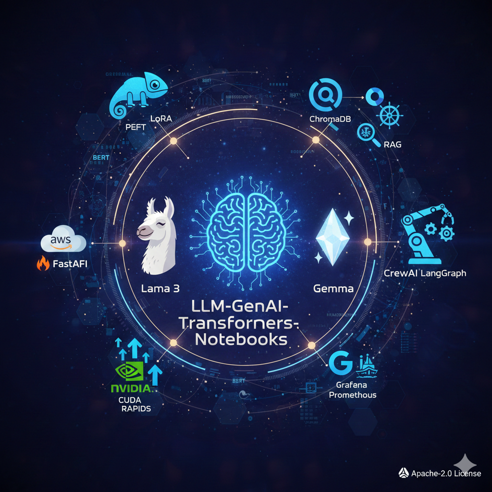

# LLM-GenAI-Transformers-Notebooks 🧠✨

**A comprehensive repository containing tutorials, projects, and notebooks for Large Language Models (LLMs), Generative AI, and Transformer architectures.**

This repository is designed for engineers, data scientists, and developers looking to master the full lifecycle of LLM development—from fundamental concepts and fine-tuning to advanced deployment and monitoring.

***

## 📂 Repository Structure & Key Focus Areas

This repository is organized into distinct folders covering major components of the LLM ecosystem.

| Directory | Focus Area | Description |
| :--- | :--- | :--- |
| **LLMs\_from\_Scratch** | **Foundations** | Deep dives into the inner workings of neural networks and transformer architecture. |
| **HandsOnLLMs** | **Fine-Tuning Techniques** | Practical notebooks on modern fine-tuning methods like **LoRA, PEFT**, and Reinforcement Learning techniques such as **PPO** and **DPO** (Direct Preference Optimization). |
| **ChromaDB\_semantic\_search** | **Vector Databases & RAG** | Implementations of semantic search and **Retrieval-Augmented Generation (RAG)** using **ChromaDB**. |
| **mcp-rag-system** | **Advanced RAG** | Contains a specialized RAG application setup (likely involving Milvus/MCP server). |
| **LLMs\_deployment** | **Cloud & API Deployment** | Examples for deploying LLMs, including a Perplexity-style clone application demo. |
| **Fastapi\_aws\_deploy** | **Production Deployment** | Deployment guides for LLMs (e.g., Llama) using **FastAPI** and **AWS** (potentially via Cerebrium). |
| **OpenAI\_streamlit\_app** | **Front-end Applications** | A complete **Streamlit** application showcasing an **OpenAI** chatbot implementation. |
| **gemma\_streamlit\_app** | **Model-Specific Apps** | Local deployment of the **Gemma** model using a Streamlit front-end. |
| **Email\_drafter\_agent\_FastAPI** | **Agentic Workflow** | Building a practical AI agent (e.g., an email drafter) exposed via a **FastAPI** service. |
| **NVIDIA\_CUDA\_BASICS** | **GPU Acceleration** | Tutorials and custom kernels for understanding and optimizing operations with **NVIDIA CUDA**. |
| **RAPIDS\_Data\_Science** | **GPU Data Science** | Examples using the **RAPIDS** suite for accelerating data science workflows with CUDA/Python. |
| **DeepLearningFiles** | **General Deep Learning** | Files for broader DL concepts, such as multi-output model training using Keras. |
| **grafana-prometheus implementation** | **Monitoring** | Setup for observing and monitoring LLM services using **Grafana** and **Prometheus**. |

***

## 🛠️ Key Technologies & Frameworks

This project extensively uses the following tools and libraries:

* **Models:** Llama, Gemma, GPT (via OpenAI API)
* **Frameworks:** Hugging Face **Transformers**, **PEFT**, **LoRA**, **FastAPI**, **Streamlit**
* **Vector DBs:** **ChromaDB**
* **GPU Tools:** **NVIDIA CUDA**, **RAPIDS**
* **MLOps/Monitoring:** **Grafana**, **Prometheus**
* **Cloud:** **AWS**

***

## 📚 Resources & Learning Paths

In addition to the practical notebooks, this repository includes supporting files to guide your learning journey:

* [`GenAI-blogs.md`](GenAI-blogs.md): Curated list of informative blogs and articles on Generative AI.
* [`LLM-GenAI-Courses.md`](LLM-GenAI-Courses.md): A collection of suggested courses and learning resources.
* **Fine-Tuning Notebooks:** Dedicated notebooks focusing on advanced **GPT** and open-source LLM fine-tuning strategies.

***

## 📄 License

This repository is licensed under the **Apache-2.0 License**—see the [LICENSE](LICENSE) file for details.

  <i>If you find this repository helpful, please consider giving it a star ⭐</i>

